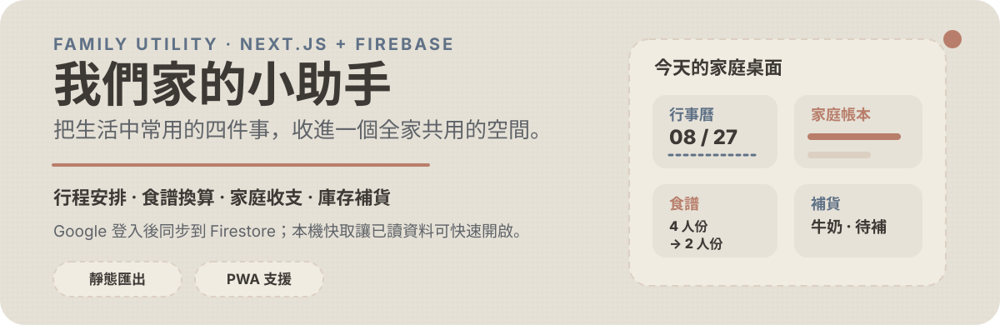
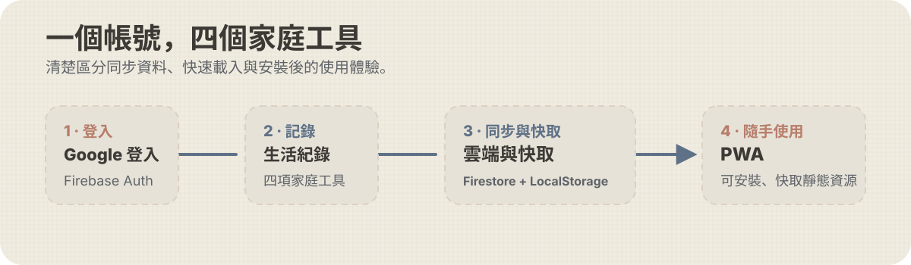

# 我們家的小助手

<p align="center">
  
</p>

> 一個為家庭日常設計的網頁工具：把行程、食譜比例、收支與補貨狀態放在同一個可共用的空間。

## 四個日常工具

| 工具 | 適合處理的事 | 主要能力 |
| --- | --- | --- |
| 📅 智慧行事曆 | 安排行程、輪班與繳費 | 分類、搜尋、倒數提醒、批次操作、寬版月曆與 PNG 複製／下載 |
| 🍳 食譜轉換神器 | 依現有食材或人數調整食譜 | 份量／食材雙模式換算、烹飪時間、PDF 匯出、搜尋與批次操作 |
| 💸 家庭帳本 | 記錄個人及共同收支 | 成員篩選、收入／支出紀錄、分類與成員占比圖表、編輯及復原 |
| 🛒 庫存與補貨 | 管理家中常備品 | 庫存下限、採買紀錄、補貨週期預測與待補排序 |

## 月曆展開與圖片分享

在「總覽」的月曆右上角點選展開圖示，側欄會順滑收合，月曆延伸至頁面寬度，顯示行程標題與時間。可繼續向下捲動；手機可左右滑動查看日期。點選收合圖示或按 `Esc` 返回原本的版面，保留目前月份與選取日期。系統設定減少動態效果時，會停用展開過渡。

| 操作 | 結果 |
| --- | --- |
| **複製圖片** | 將目前月份產生為 PNG，複製後可貼入支援圖片的聊天或文件。 |
| **下載圖示** | 儲存為 `月曆-YYYY-MM.png`，方便傳送或留存。 |

圖片沿用分類配色，完整列出月曆日期格內的行程標題與時間，不受畫面捲動位置或格內顯示數量限制。標題保留粗體、縮小上方留白，並依可用寬度調整字級，讓「百頁助教班（半天）」等一般標題維持單行；過長標題仍完整換行，右括號不會單獨落在下一行。

匯出沿用目前的搜尋、分類與日期區間篩選，分享前請先確認篩選結果。圖片在瀏覽器內產生；若瀏覽器不支援圖片剪貼簿或拒絕複製，會改為下載 PNG，並以浮動提醒告知結果。

## 為什麼放在一起？

家庭生活不是四套彼此孤立的資料。這個專案把經常需要一起查看、一起更新的資訊整理成一致的操作方式：登入後同步資料、先從本機快取快速開啟，再視需要在手機或桌面安裝成 PWA。

<p align="center">
  
</p>

## 使用方式

1. 使用 Google 帳號登入。
2. 從導覽列進入「總覽」、「食譜神器」、「家庭帳本」或「庫存與補貨」。
3. 新增資料後，對應的自訂 Hook 會處理 Firestore 同步與本機快取。

### 快速操作提示

- 行事曆可用關鍵字、分類與日期區間縮小結果；近期與過往行程可快速預覽。
- 「冥夜小助手」旁的外部連結圖示表示會在新分頁開啟；頂部導覽列已移除音樂入口。
- 食譜可從基準份數調整，或輸入手邊食材量反推其他食材；計算結果可匯出 PDF。
- 帳本可在全體或指定成員檢視下切換，圖表會依目前篩選範圍呈現。
- 補貨清單會將到期／庫存不足項目優先排在前面。

## 資料與體驗設計

- **Firebase Auth + Firestore**：以 Google 登入識別使用者，並儲存行程、食譜、帳本及補貨資料。
- **LocalStorage 快取**：先還原已讀資料，降低重新開啟時的等待感；同步失敗時保留可見資料並提供提示。
- **樂觀更新與復原**：刪除等常用操作先反映在畫面上，部分列表操作提供 5 秒復原。
- **Woven & Weft 介面**：使用暖米、燕麥白、鐵鏽紅與石板藍，搭配虛線縫線與紙卡質感。
- **PWA**：可安裝到主畫面；Service Worker 快取靜態資源與已載入資料的瀏覽情境。

## 技術架構

```text
src/
├── app/                    # App Router：總覽、食譜、帳本、補貨頁面
├── components/             # 共用導覽、對話框、載入與各工具元件
├── hooks/                  # Firebase CRUD、快取與沉浸式體驗
├── lib/                    # Firebase 初始化與補貨預測工具
└── types/                  # 共用 TypeScript 型別
```

| 類別 | 使用技術 |
| --- | --- |
| 前端 | Next.js 16、React 19、TypeScript、Tailwind CSS |
| 資料 | Firebase Auth、Cloud Firestore、LocalStorage |
| 視覺化／匯出 | Recharts、Canvas（月曆 PNG）、Clipboard API、jsPDF、html2canvas（食譜） |
| PWA | `@ducanh2912/next-pwa` |
| 部署 | GitHub Pages（靜態匯出） |

## 本機開發

### 1. 安裝依賴

```bash
npm install
```

### 2. 設定 Firebase 環境變數

在專案根目錄建立 `.env.local`：

```env
NEXT_PUBLIC_FIREBASE_API_KEY=your_api_key
NEXT_PUBLIC_FIREBASE_AUTH_DOMAIN=your_project.firebaseapp.com
NEXT_PUBLIC_FIREBASE_PROJECT_ID=your_project_id
NEXT_PUBLIC_FIREBASE_STORAGE_BUCKET=your_project.appspot.com
NEXT_PUBLIC_FIREBASE_MESSAGING_SENDER_ID=your_sender_id
NEXT_PUBLIC_FIREBASE_APP_ID=your_app_id
```

### 3. 啟動開發伺服器

```bash
npm run dev
```

開啟 [本機預覽](http://localhost:3000/family_app)；開發伺服器使用 Webpack。開發模式會停用 PWA；請以 production build 驗證 Service Worker 行為。

## 建置與部署

```bash
# 靜態匯出至 out/，以 Webpack 建置 PWA
npm run build

# 本機以 gh-pages 發佈 out/
npm run deploy
```

專案的 GitHub Actions 會在 `main` 分支推送後執行 `npm ci`、注入 Firebase Secrets、建置並部署至 GitHub Pages。靜態部署路徑由 `next.config.ts` 的 `basePath: '/family_app'` 設定。

## 專案腳本

| 指令 | 用途 |
| --- | --- |
| `npm run dev` | 啟動本機開發伺服器 |
| `npm run lint` | 執行 ESLint |
| `npm run build` | 靜態建置並產出 `out/` |
| `npm run deploy` | 建置後發佈 `out/` 到 gh-pages |

## 相關提醒

- Firebase 設定值與 GitHub Actions Secrets 不會提交到儲存庫。
- `public/sw.js` 與 `public/workbox-*.js` 由 PWA 建置流程產生，無須手動編輯。
- 每日行程提醒工作流程會讀取獨立的 LINE 與 Firebase 憑證 Secrets。

## 授權

此專案目前標示為私人專案（`private: true`）。

---

Created by **Brian** · 2026
